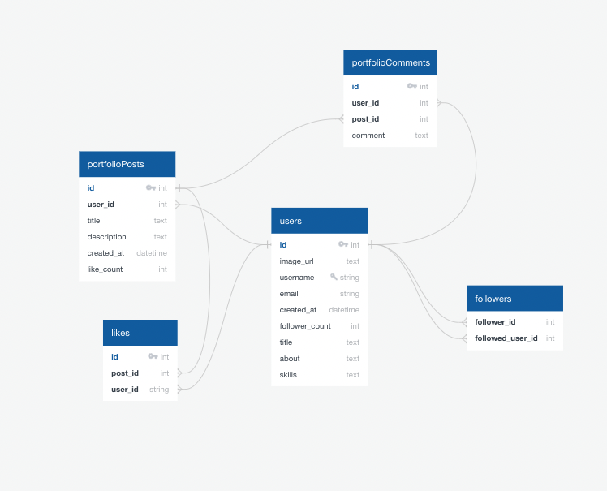

# [DevHead Live Site](https://dev-head-willyv4.vercel.app/)

# API DATA

- Personal backend API
- Github Graphql API
- LeetCode Graphql API
- Clerk Auth API
- Cloudinary API (Image uploads)

# Database Outline

---

# DevHead Features

### Profile Page

- Customizable Profiles: Users create unique digital identities by personalizing their profile pages with pictures, bio, skills, and contact info.

- Showcase Contributions: A central hub for displaying contributions, projects, and statistics.

- Integrate LeetCode and GitHub: Connect accounts to reveal proble-solving abilities and GitHub contributions.

- Flexible Customization: Conveniently add, edit, or delete features and posts to keep profiles current.

- Post Management: Create, edit, and delete posts directly from the profile page.

- Profile Completion Notifications: Encourage completion for visibility on the Devs page.

### Landing Page

- Introduction: Initial platform overview with key features.

- Navigation: Visitors can explore, sign in, or register.

### About Page

- In-Depth Information: Learn more about DevHead, its platform, developer, and future vision.

### Devs Page

- User Directory: Explore and connect with developers who completed their profiles.

### Post Page

- Dynamic Feed: Engage with developer posts through likes, comments, and links.

### Customization and Posting

- User Control: Customize profiles and posts to reflect evolving skills and projects.

### Authentication and Security

- Secure Login: OAuth-based authentication ensures user data safety.

---

# DevHead User Flow (Before and After Login)

### Before Login

1.  **Initial Visit**:

    - New visitors arrive at DevHead.
    - Explore Landing Page and About Page without login.

2.  **Landing Page (Before Login)**:

    - Learn about site purpose and key features.
    - Navigate to other pages or sign in/register.

3.  **About Page (Before Login)**:

    - Access detailed information about DevHead, its mission, and vision.

4.  **Authentication and Security (Login/Sign Up)**:
    - Secure OAuth-based authentication for registration and login.

### After Login

5.  **Landing Page (After Login)**:

    - Redirected to Landing Page with navigation options.

6.  **Navigation Bar**:
    - Access different sections:
    - **Profile Page**: Customize your profile, manage posts.
    - **Devs Page**: Explore other developers.
    - **Post Page**: Engage with posts from developers.

# Tests

- you can run tests with `npm run test`
- tests are located in the modules files and route-tests file
